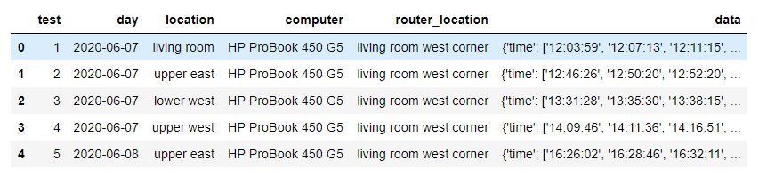

# Speedtest

Having recently moved into a new location, my current setup includes a separate router. 
The Belkin router is a bit outdated so I'm testing average speeds throughout the house using a quick [Python script](speedtest.py) that calls [ookla's speedtest executable](https://www.speedtest.net/apps/desktop) to run speed tests. 

## Data Collection

The script is run with no arguments - you're prompted for information instead:

```bash
$ python speedtest.py
Make sure to git pull before proceeding.

Enter room name: living room
Enter router location: hallway upstairs
Loop 1: waiting for 124 secs...
```

A warning lets you know to do a `git pull` before proceeding, i.e.:

```bash
$ git pull origin master
```

You'll need to input string fields with consistent names for where you're conducting the test and where the router is located (if you vary this location for testing). The script will automagically extract the machine name and info via a subprocess to pass a wmic command, see line 105 for details.

The script can be customized of course, but as is, it doesn't accept different number of tests or wait times. The default is 10 tests and a random wait time between test from 10 seconds to 5 minutes. This can be changed at line 131 or a revision can be made to include arguments passed or more questions. 

```python
def collect_info(iters=10, mins=5):
    """Perform iters speed tests with up to mins mins of wait 
    time between them and collect results.
    """
```

The data collected is a JSON file with the following fields - here as an example run with only two tests (two iterations of `collect_info` above):

```
{
    "test": 37,
    "day": "2020-06-23",
    "location": "lower west",
    "computer": "HP ProBook 450 G5",
    "router_location": "hallway upstairs",
    "data": {
        "time": [
            "14:29:51",
            "14:31:49"
        ],
        "jitter": [
            1.518,
            1.544
        ],
        "latency": [
            9.971,
            10.742
        ],
        "download": [
            86.167693,
            55.747131
        ],
        "upload": [
            4.570244,
            7.407206
        ]
    }
}
```

## Data Wrangling and Visualization


With a few custom data wrangling and plotting functions (see [custom module](custom_module.py)) I can get a sense of the variation in download speeds (most of my concern). [This notebook](plot_speedtest.ipynb) captures some of this work.

The JSON can be brought in for analysis as a Pandas DataFrame, which is flexible enough to accommodate nested dict structures (i.e. the "data"):



We can plot a single run of the script and see details about the speeds given each test:


Since this is too much detail for a broader understanding of variation - I use heatmaps and boxplots to delve into slices of the data.

The heatmap shows brighter colors for higher download speeds. Each column is a given test run (or "data collection/ingestion") and each row a particular speed test's download speed result in Mbps (visualized as color).


Boxplots are great for showing `within` and `in-between` comparisons of the variation in speeds, given a dimension such as "location of the laptop":


However, there are significant confounders to this simplified view since I moved the router location and used different computers. The notebook goes into the details.

## Conclusion

Suffice to say, I did not collect enough samples for a robust stratified analysis but got enough observations to satisfy my curiosity and needs.

The most surprising and unfortunate result of this effort was that the variation in speeds is a lot greater than one would wish for, so our common sense attribution of a particular "cause" (such as time of day, router location, etc.) to a particular "outcome" (bad download speed) is probably more of a story we like to tell than a truth. The reality is that what drives most of the variation in speeds is most probably chance and ISP conditions out of our control.

---


